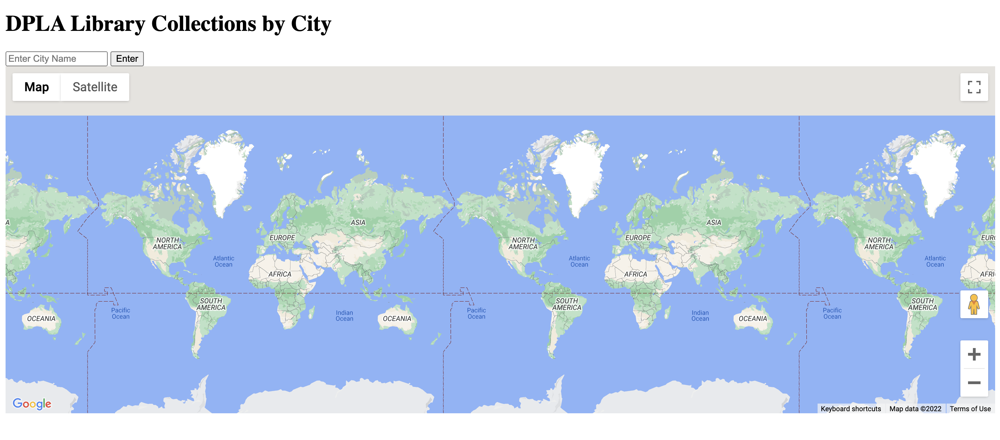
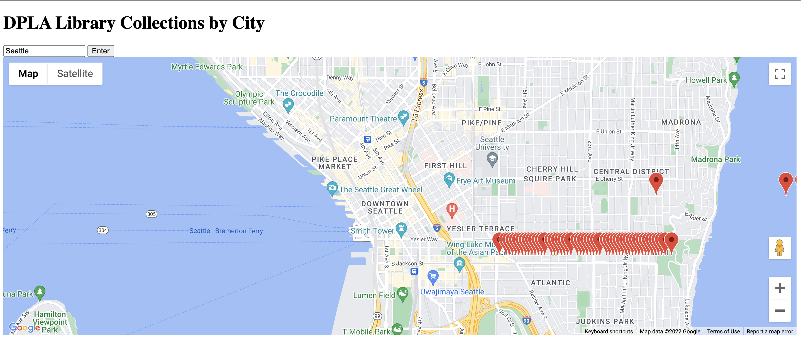
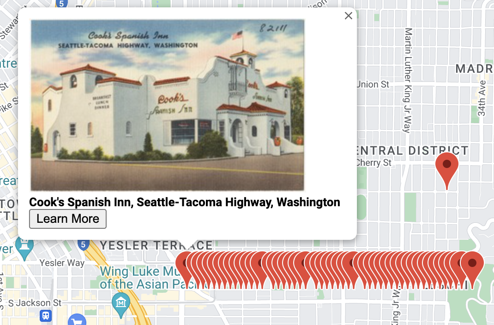

# Digital Public Libraries of America Collections by City
Digital Public Library of America (DPLA) is a free and open national digital library collection with a goal to educate and empower everyone.  They have an API that allows you to search every item in their catalog.

## Feature Set
Users of DPLA Collections by City can enter any city into the website, and see a map with a pin for each item of the DPLA collection that corresponds with that city.

### Collections Item Pin
Each collection item can be clicked to view the photo of the item, the title of the item, and a link that will take users to the source library's information page for the item.

## Environment Set-up
Digital Public Libraries of America Collections by City was built using Flask.

All potential developers must have:
 - Python 3 
 - Google Maps API key
 - DPLA API key

### Python
This web app framework was built using Flask, an application for Python.  In order to run the application locally, you will need to have the latest version of Python installed on your computer.  Please note that below in the installation instructions, I also use virtual environments and pip (a package manager), you will need to install these as well, though you don't have to, you could use whichever package manager you prefer and install requirements not in a venv.  It is up to you.

- Install Python: https://www.python.org/downloads/ 

### DPLA
Access to the Digital Public Libraries of America Collections by City catalog requires a DPLA API key.  In order to run the application locally, you will need to register your own API key and include this script in your static/specific_map.js file:
​​ 
``
 
- Get a DPLA API key: https://pro.dp.la/developers/policies#get-a-key 

### Google Maps
Digital Public Libraries of America Collections by City utilizes a Google Maps API key.  In order to run the application locally, you will need to register your own API key and include this script in your template/map.html file:
​​ 
``
 
- Get a Google Maps API key: https://developers.google.com/maps/documentation/javascript/get-api-key 

## Installation
To install this codebase on your local computer for development after the above has been completed:
1. Clone this repository.
2. Create a new virtual environment (note, I do have my venv in this GitHub repository, but you will want to create your own locally). Steps:
   1. Navigate to the project's root folder.
   2. Type in this command `python3 -m venv virtual_env`
   3. Please activate your virtual environment with `source virtual_env/bin/activate`.
   4. Please deactivate your virtual environment with `deactivate`, and then reactviate it with the above command.
3. In the activated virtual environment, install dependencies by running `pip install -r requirements.txt` in your command line.

## Future Enhancements
You may have noticed that all the collection item pins were in a straight line.  When I initially read the API documentation for DPLA, I assumed that the location coordinates for each item would be a little more distinct, unforutnately, they were mostly geolocated to the City.  In order to show multiple items then, I needed to assign them each unique pins.  Given the timebox of this project, I simply nudged each collection item pin over .0005 degrees in longitude. A future enhancement would be to have each item reflected more the location of origin.

An additional note, the DPLA API limits each api query to 500 items.  So it would be a cool enhancement to accurately reflect the entirety of items in the digital collection on the map. 

